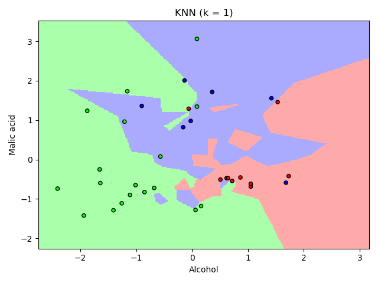
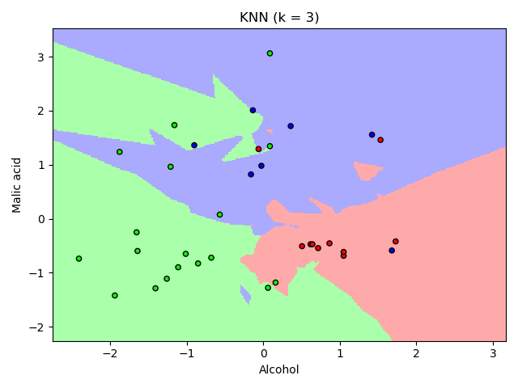
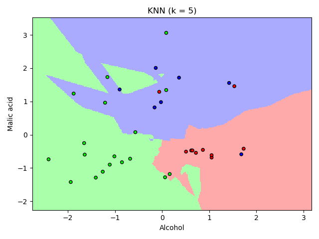
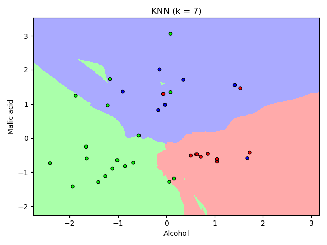
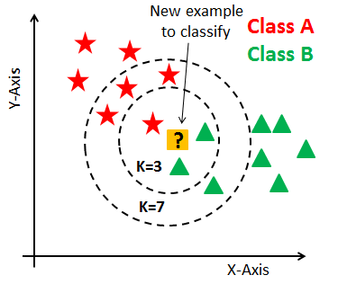

**Abstract**: The purpose of this repository is to show how classification
work through the use of KNN and SVM and how the results obtained change
with the tuning of the various hyperparameters of the algorithms. To do
that *sklearn.datasets.load\_wine* was used and some tests are been
conducted:

-   For  *K* in [1,3,5,7] $ KNN was built.

-   For  *C* in [0.001, 0.01, 0.1, 1, 10, 100, 1000] linear SVM was
    built.

-   For  *C* in [0.001, 0.01, 0.1, 1, 10, 100, 1000] SVM with $RBF$
    kernel was built.

-   A grid search was performed for *gamma* and *C* for each possible
    pair an SVM with $RBF$ kernel was built.

-   A grid search was performed for *gamma* and *C* but this time
    perform 5-fold validation.

For each experiment the best model was used to evaluate the test set.

To better understand the theory behind the project there is a brief explanation of the main concepts at the end of the README file.

Description of the project
==========================

The aim of the work is to see the different behaviors between KNN and
SVM and how they change as hyperparameters change. To do this, the first two features were selected from the 
[wine dataset](https://scikit-learn.org/stable/modules/generated/sklearn.datasets.load_wine.html) and
 the data was randomly divided into three sets:

-   *Train*: the sample of data used to fit the model. The classifier
    sees and learns from this data.

-   *Validation*: the sample of data used to provide an evaluation of a
    model fit on the training dataset while tuning model
    hyperparameters. So the validation set in a way affects a model, but
    indirectly.

-   *Test*: The sample of data used to provide an unbiased evaluation of
    a final model fit on the training dataset. It is only used
    when the model is completely trained.

The first set is composed by 50\% of the data, the second one by
20\% and the last one by 30\%.\
\
Since the range of values of raw data may vary widely, in some machine
learning algorithms, objective functions will not work properly without
normalization. For example, KNN calculates the distance between the new
point and the elements contained in train set so if one of the features
has a broad range of values, the distance will be governed by this
particular feature. Therefore, the range of all features should be
normalized so that each feature contributes approximately
proportionately to the final distance. To do this the class
[sklearn.preprocessing.StandardScaler](https://scikit-learn.org/stable/modules/generated/sklearn.preprocessing.StandardScaler.html) was used.

Multiple models have been built using *K* between 1 and 7 using the
[sklearn.neighbors.KNeighborsClassifier](https://scikit-learn.org/stable/modules/generated/sklearn.neighbors.KNeighborsClassifier.html) to which the train set was
passed. Euclidean distance was used as metric. Through the use of the
model the decision boundaries were printed and the validation set was
evaluated.

 

In the images above, it is visible how KNN classifies the
elements of the validation set based on the decision boundaries.
Decision boundaries change because as *K* increases, they are influenced
by more distant elements. In particular it is visible that for small *K*
they are more jagged whereas for larger *K* they tend to be smoother.

The figure above shows that, for this data distribution, the classifier
for *K = 3* and *K = 5* obtains the worst result (71.42\%) on the
validation set, whereas the accuracy improves considerably for *K = 1*.
The accuracy for this value of the model is (80.007\%). The
classifier, trained with *k = 1* and evaluated on the test set has an
accuracy of 77.78\%. It is very important to note that the results
thus obtained depend on the random shuffle performed at the beginning,
and that, with other shuffles, different results are obtained.\
\
Later for *C* in [0.001, 0.01, 0.1, 1, 10, 100, 1000] the model was
built using the class [sklearn.svm.SVC](https://scikit-learn.org/stable/modules/generated/sklearn.svm.SVC.html) and the linear kernel.

As above the model was trained with the train set and decision
boundaries were printed.

The decision boundaries obtained for *C = 0.001* is due to the fact that
the weight given to the errors committed in the train set, *C*, is so
low that it does not affect the objective function of the SVM. The only
purpose of the classifier is therefore to obtain wider margins that are
possible.

On the other hand, when it was assign larger values to *C* the model tries
to make fewer mistakes but reduces the margins. For *C > 10* the
diagrams are not shown because there are no changes. In all cases, since
the linear kernel was used the hyperplanes are formed by straight lines.

The figure above shows the evolution of the accuracy of the model
evaluated on the validation set when *C* changes. Accuracy reaches its
maximum value (77.14\%) for *C = 0.1* and for *C = 1*. For values
higher than *C* the accuracy of the model decreases because the
classifier gives too much weight to the mistakes made during the train
and therefore to reduce these errors reduces the margins. However, this
makes it easier for SVM to make mistakes by classifying data it has
never seen. The classifier, trained with *C = 0.1*, and evaluated on the
test set has an accuracy of 87.04\%.\
\
Since it is not possible to find a linear decision boundary for the
classification problem then the data was projected in to a higher
dimension from the original space to try to find a hyperplane in the new
dimension that helps to classify the data. To do this the SVM kernel has
been changed, from linear to RBF. In this way we introduce a new hyperparameter *gamma*
that can be seen as the inverse of the radius of influence
of samples selected by the model as support vectors. All tests performed
on the SVM have been repeated leaving the default value for *gamma*.

The decision boundary calculated with *C=0.001* and the RBF kernel is
the same as that calculated with the same *C* and linear kernel, because
in both cases too little weight has been given to the misclassification.

The graphs, for a sufficiently high *C*, show how the decision
boundaries are no longer formed by straight lines but by curve lines,
this is due to the use of a non-linear kernel.

The maximum accuracy, calculated on the validation set, for the various
values of *C*, improves passing from 77,14\%, for the SVM with linear
kernel, to 80.00\% always for *C = 0.1*. The accuracy on the test set
of the classifier, trained with the best *C* on the validation set,
increases from 75.92\% to 79.63\%. This is due to the fact that the
data is better separable in a higher dimension.

To try to further improve the results both *gamma* and C are tuned at
the same time. The set of values tested for *gamma*is
[0.001, 0.005, 0.01, 0.05, 0.1, 0.5, 1, 10] and for *C* is
[0.01, 0.05, 0.1, 0.5, 1, 5, 10, 100, 1000]. The lower value of *C*
was not taken, as the previous experiments show that with this value a
worse model was obtained compared to the other values.

The behavior of the model is very sensitive to the *gamma* parameter.
If it is too large, the radius of the area of influence of the
support vectors only includes the support vector itself and no amount of
regularization with *C* will be able to prevent overfitting.

When *gamma* is very small, the model is too constrained and cannot
capture the complexity or “shape” of the data. The region of influence
of any selected support vector would include the whole training set. The
resulting model will behave similarly to a linear model.

The couple of hyperparameters that gives a better accuracy (85.71\%)
on the validation set is (*C = 1000, gamma = 0.05*). The accuracy on
the test set of the classifier, trained with these value, is 81.48\%.
The model is more precise than the previous one because both *gamma*
and *C* have been tuned at the same time.

After merge of training and validation split it was done a grid search
for *gamma* and *C* perform 5-fold validation. To do k-fold validation
was used the function [sklearn.model\_selection.cross\_val\_score](https://scikit-learn.org/stable/modules/generated/sklearn.model_selection.cross_val_score.html).

The couple of hyperparameters that gives a better accuracy (79.05\%)
on the validation set is (*C = 100, gamma = 0.05*). The accuracy on the
test set of the classifier, trained with these value, is 87.04\%.
Accuracy increases on the test set, this could be due to the fact that
by trying different combinations of data the model has learned of
patterns not previously known.\
\
Since irrelevant data components can adversely affect the model’s
performance, it was decided to use a feature selection technique to
determine a feature ranking and use the best and the worst couple to
retrain both models, KNN and SVM. To create the ranking, which is
independent of the classifier, the [Relief](https://epistasislab.github.io/scikit-rebate/using/) algorithm was used,
this is a filter type method that assigns score to the features. This
score goes between -1 and 1, where a greater weight indicates a greater
relevance of this feature. The score was calculated using only train and
validation set. Below are showed the scores for each features.

1.  od280/od315 of diluted wines 0.190

2.  flavanoids 0.176

3.  proline 0.171

4.  alcohol 0.152

5.  color intensity 0.133

6.  total phenols 0.114

7.  hue 0.110

8.  malic acid 0.081

9.  nonflavanoid phenols 0.061

10. alcalinity of ash 0.054

11. proanthocyanins 0.047

12. magnesium 0.030

All the experiments performed on the features(*alcohol, malic acid*)
have been repeated for the couples of features (*proanthocyanins,
magnesium*) and (*od280/od315 of diluted wine, flavanoids*).

||*proanthocyanins,* | *od280/od315,*|
|| *magnesium* | *flavanoids*|
---------------------------------------
|KNN (*K*) | 57.40\% | 81.48\% |
|linear SVM (*C*) | 50.00\% | 83.33\% |
|rbf SVM(*C*) | $46.29\% | 85.18\% |
|rbf SVM(*C*, *gamma*) | 55.55\% | 85.18\%|
|Cross-fold(*C*, *gamma*) | 55.55\% | 85.18\%|

The accuracy obtained on the test set are reported in the tab [second]:
it can be seen how the use of different features strongly changes the
results obtained. As expected the features with higher scores had better
results than the other two pairs tested.

Classification
==============

In machine learning and statistics, classification is the
problem of identifying to which of a set of categories a new observation
belongs, on the basis of a training set of data containing observations
(or instances) whose category membership is known. Examples are
assigning a given email to the “spam” or “non-spam” class, and assigning
a diagnosis to a given patient based on observed characteristics of the
patient (sex, blood pressure, presence or absence of certain symptoms,
etc.). Classification is an example of pattern recognition.

A wide range of supervised learning algorithms are available, each with
its strengths and weaknesses. There is no single learning algorithm that
works best on all supervised learning problems.

K-Nearest Neighbour\
(KNN)
====================

Neighbors-based classification is a type of instance-based learning or
non-generalizing learning: it does not attempt to construct a general
internal model, but simply stores instances of the training data.
In pattern recognition, the KNN algorithm is used for classification and
regression. In the classification process, the output is a class
membership.

Classification is done by a majority vote of *K* nearest neighbours. The
basic nearest neighbors classification uses uniform weights, under some
circumstances, it is better to weight the neighbors such that nearer
neighbors contribute more to the vote. Only uniform weights were used
during the experiments

*K* in KNN is a hyperparameter that must be chosen when the model is
built. It can be interpreted as a control variable for the prediction
model. Each dataset has it is own requirements but usually value of *K*
is odd when the number of classes is two, in order to avoid the same
quantity of votes for both classes. In the case of a small number of
neighbors, the noise will have a higher influence on the result on the
other hand a large number of neighbors makes the classification
boundaries less distinct and the new data is influenced, especially in
a sparse space, by points distant from them.

To define which are the nearest *K* neighbors it can be use different
distance. It is possible to choose different metrics to measure the distance
between the various data because there was no metric of the optimal
distance that could be used for all types of datasets as the free lunch
theorem states.

There is a possibility that using different distance metrics we might
get better results. So, in non-probabilistic algorithm like KNN distance
metrics plays an important role.

Nearest Neighbors Classifier is attractive for classification because it
can naturally handle multi-class problems without any increase in the
model size, and does not introduce additional parameters that require
fine-tuning by the user.

Support Vector Machine\
(SVM)
=======================

A Support Vector Machine is a discriminative classifier formally defined
by a separating hyperplane. In other words, given labeled training data,
the algorithm outputs an optimal hyperplane which categorizes new
examples. Intuitively, the best separation is achieved by the hyperplane
that has the largest distance to the nearest training point of any
class, since in general the larger this distance, the smaller the
generalization error of the classifier.

If the training data is linearly separable, we can select two parallel
hyperplanes that separate the two classes of data. The region bounded by
these two hyperplanes is called the “margin”, and the maximum-margin
hyperplane is the hyperplane that lies halfway between them.

\
In real applications there is not always a margin, therefore classes are
not always linearly separable in the space of features through a
hyperplane. Positive slack variables are introduced to relax the margin constraint. 

In this way we introduce a new hyperparameter *C* that decides the trade-off between
maximizing the margin and minimizing the mistakes. When *C* is small, to
the classification mistakes are given less importance and focus is more
on maximizing the margin, whereas when *C* is large, the focus is more
on avoiding misclassification at the expense of keeping the margin
small.